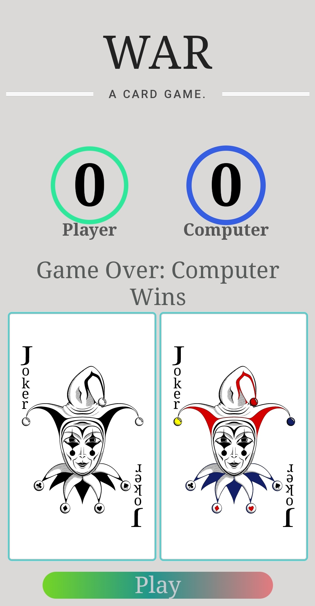
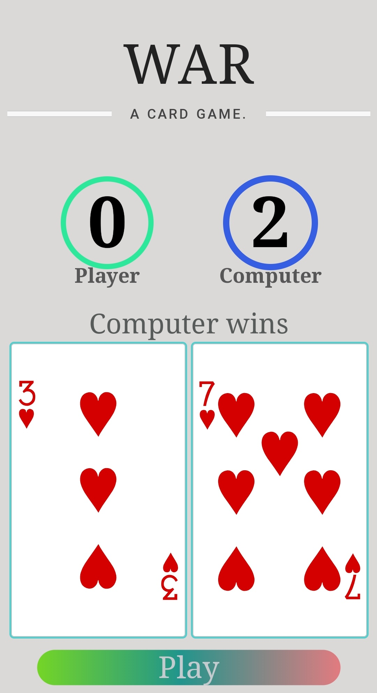

<h1 align="center" style="
  text-align: center;
  font-size: 30px;
  text-transform: uppercase;
  color: #222;
  letter-spacing: 1px;
  font-family:  serif;
  font-weight: 400;">War Card Game</h1>

<p align="center">
  <a href="#camer_flash-screenshot">Screenshots</a> &#xa0; | &#xa0;

<a href="#dart-about">About</a> &#xa0; | &#xa0;
<a href="#sparkles-features">Features</a> &#xa0; | &#xa0;
<a href="#rocket-technologies">Technologies</a> &#xa0; | &#xa0;
<a href="#white_check_mark-requirements">Requirements</a> &#xa0; | &#xa0;
<a href="#checkered_flag-starting">Starting</a> &#xa0; | &#xa0;
<a href="#memo-license">License</a> &#xa0; | &#xa0;
<a href="https://github.com/ricardo39985" target="_blank">Author</a>

<a href="https://ricardo39985.github.io/war-card-game/
" target="_blank">Github Pages</a>

</p>

<p align='center'>
  <a href="https://www.linkedin.com/in/ricardo-persaud/">
    
  </a>&nbsp;&nbsp;
<a href="https://nodejs.org/en/   ">
    
  </a>&nbsp;&nbsp;
  <a href="https://www.w3.org/TR/CSS/#css">
    
  </a>&nbsp;&nbsp;
  <a href="https://html.spec.whatwg.org/multipage/">
    
  </a>&nbsp;&nbsp;
  <a href="https://www.javascript.com/">
    
  </a>&nbsp;&nbsp;

</p>

<p align='center'>
  💻 My Machine<br/><br/>
  <picture>
   </picture>
  <picture>
  
  </picture>
   <picture>
  
   </picture>
<picture>
  
</picture>
<picture>
  
</picture>

</p>

<br>

## :camera_flash: Screenshot

<p float="left" style="margin: auto; width: 90%">
  
  
  
</p>

## :dart: About

<p>
The goal is to be the first player to win all 52 cards<br>

THE DEAL<br>
The deck is divided evenly, with each player receiving 26 cards, dealt one at a time, face down. Anyone may deal first. Each player places their stack of cards face down, in front of them.<br>

THE PLAY<br>
Each player turns up a card at the same time and the player with the higher card takes both cards and puts them, face down, on the bottom of his stack.<br>

If the cards are the same rank, it is War. Each player turns up one card face down and one card face up. The player with the higher cards takes both piles (six cards). If the turned-up cards are again the same rank, each player places another card face down and turns another card face up. The player with the higher card takes all 10 cards, and so on.<br>

HOW TO KEEP SCORE<br>
The game ends when one player has won all the cards.</p>

## :sparkles: Features

:heavy_check_mark: Javascript Event listeners\
:heavy_check_mark: CSS3 Styling\
:heavy_check_mark: Points Tracking\
:heavy_check_mark: Forefeit\
:heavy_check_mark: Card rendering

## :rocket: Technologies

The following tools were used in this project:

- 
- 
- 

## :white_check_mark: Requirements

Before starting :checkered_flag:, you need to have [Git](https://git-scm.com) and [Node](https://nodejs.org/en/) installed.

## :checkered_flag: Starting

```bash
# Clone this project
$ git clone https://github.com/ricardo39985/war-card-game.git

# Access
$ cd web-game-project

# Open index.html with your favorite browser
```

## :fast_forward: Next Steps
- [ ] More Styling
- [ ] Animation
- [ ] Name input
- [ ] High Score Keeper

## :memo: License

Copyright <2022> <Ricardo Persaud>

Permission is hereby granted, free of charge, to any person obtaining a copy of this software and associated documentation files (the "Software"), to deal in the Software without restriction, including without limitation the rights to use, copy, modify, merge, publish, distribute, sublicense, and/or sell copies of the Software, and to permit persons to whom the Software is furnished to do so, subject to the following conditions:

The above copyright notice and this permission notice shall be included in all copies or substantial portions of the Software.

THE SOFTWARE IS PROVIDED "AS IS", WITHOUT WARRANTY OF ANY KIND, EXPRESS OR IMPLIED, INCLUDING BUT NOT LIMITED TO THE WARRANTIES OF MERCHANTABILITY, FITNESS FOR A PARTICULAR PURPOSE AND NONINFRINGEMENT. IN NO EVENT SHALL THE AUTHORS OR COPYRIGHT HOLDERS BE LIABLE FOR ANY CLAIM, DAMAGES OR OTHER LIABILITY, WHETHER IN AN ACTION OF CONTRACT, TORT OR OTHERWISE, ARISING FROM, OUT OF OR IN CONNECTION WITH THE SOFTWARE OR THE USE OR OTHER DEALINGS IN THE SOFTWARE.

This project is under license from MIT. For more details, see the [LICENSE](LICENSE.md) file.

Made with :heart: by <a href="https://git.generalassemb.ly/ricardo1181" target="_blank">Ricardo Persaud</a>

&#xa0;

<a href="#top">Back to top</a>
